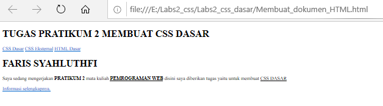
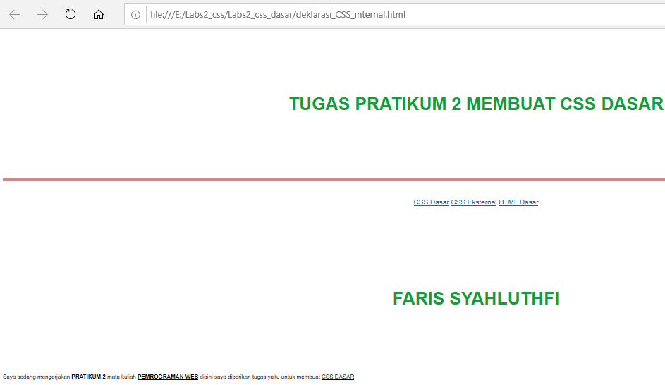
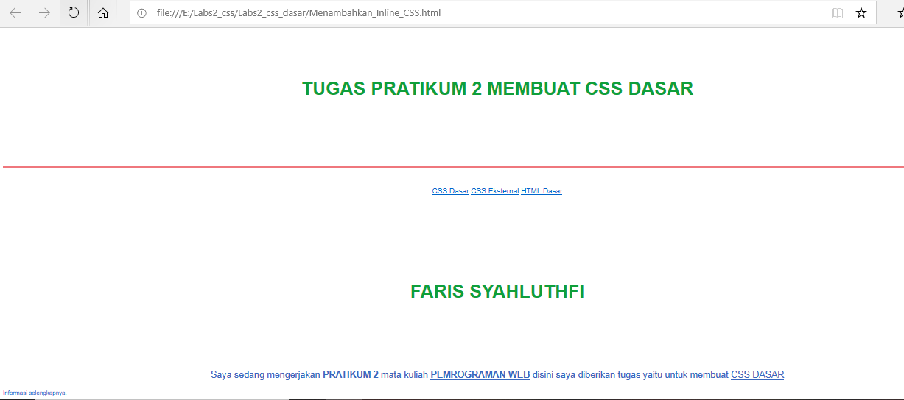
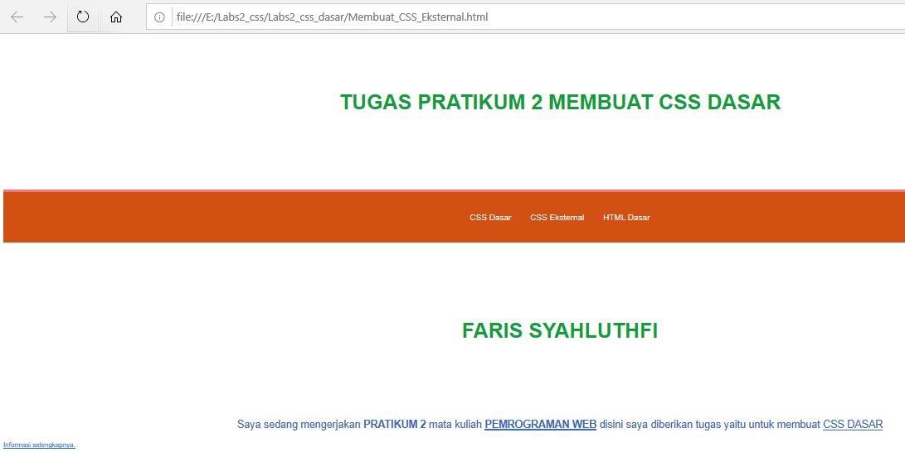
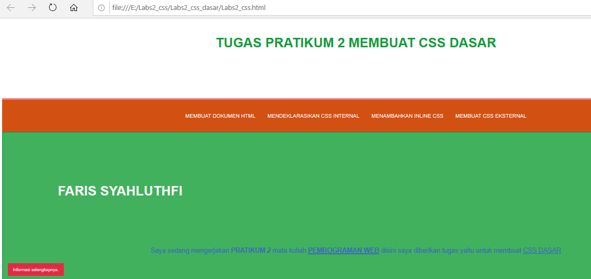

# Labs2_css_dasar

| Nama= Faris Syahluthfi      | 
|-----------------------------|
| NIM= 312010034              |
|=============================| 
| Kelas= TI.20.A.1            |
|-----------------------------|
| Matkul= Pemrograman Web     |
|=============================|

## 1. Membuat dokumen HTML


Ini adalah sebuah hasil dari texs Kodingan tag membuat dokumen HTML<p>
 Dan Ini Adalah program codingan dari tag membuat dokumen HTML:

## Contoh Kode
```html
<!DOCTYPE html>
<html lang="en">
<head>
<meta charset="UTF-8">
<meta name="viewport" content="width=device-width, initial-scale=1.0">
<title>CSS Dasar</title>
</head>
<body>
<header>
    <h1><b>TUGAS PRATIKUM 2 MEMBUAT CSS DASAR</b></h1>
</header>
<nav>
<a href="lab2_css_dasar.html">CSS Dasar</a>
<a href="lab2_css_eksternal.html">CSS Eksternal</a>
<a href="lab1_tag_dasar.html">HTML Dasar</a>
</nav>
<!-- CSS ID Selector -->
<div id="intro">
    <h1>FARIS SYAHLUTHFI</h1>
<p>Saya sedang mengerjakan <b>PRATIKUM 2</b> mata kuliah <b><u>PEMROGRAMAN WEB</u></b> 
    disini saya diberikan tugas yaitu untuk membuat <u>CSS DASAR</u></p>
<!-- CSS Class Selector -->
<a class="button btn-primary" href="#intro">Informasi selengkapnya.</a>
</div>
</body>
</html>
```

## 2. Mendeklarasikan CSS Internal


Ini adalah sebuah hasil dari texs Kodingan tag Mendeklarasikan CSS Internal<p>
 Dan Ini Adalah program codingan dari tag Mendeklarasikan CSS Internal:

 ## Contoh Kode

 ```html

<!DOCTYPE html>
<html lang="en">
<head>
<meta charset="UTF-8">
<meta name="viewport" content="width=device-width, initial-scale=1.0">
<title>CSS Dasar</title>
</head>
<body>

    <head>


        <title>CSS Dasar</title>
        <style>
        body {
        font-family:'Open Sans', sans-serif;
        }
        header {
        min-height: 100px;
        border-bottom:5px solid #ef777d;
        }
        nav {
            font-size: 20px;
            text-align: center;
            padding: 50px 25px ;
        }
        h1 {
        font-size: 50px;
        color: #0f9f3a;
        text-align: center;
        padding: 150px 200px;
        }
        h1 i {
        color:#6d6d6a;
        }
        
        </style>
        </head>

<header>
    <h1><b>TUGAS PRATIKUM 2 MEMBUAT CSS DASAR</b></h1>
</header>
<nav>
<a href="lab2_css_dasar.html">CSS Dasar</a>
<a href="lab2_css_eksternal.html">CSS Eksternal</a>
<a href="lab1_tag_dasar.html">HTML Dasar</a>
</nav>
<!-- CSS ID Selector -->
<div id="intro">
    <h1>FARIS SYAHLUTHFI</h1>
<p>Saya sedang mengerjakan <b>PRATIKUM 2</b> mata kuliah <b><u>PEMROGRAMAN WEB</u></b> 
    disini saya diberikan tugas yaitu untuk membuat <u>CSS DASAR</u></p>
<!-- CSS Class Selector -->
<a class="button btn-primary" href="#intro">Informasi selengkapnya.</a>
</div>
</body>
</html>

 ```


## 3. Menambahkan Inline CSS


Ini adalah sebuah hasil dari texs Kodingan tag Menambahkan Inline CSS<p>
 Dan Ini Adalah program codingan dari tag Menambahkan Inline CSS:

## Contoh Kode
```Html
<!DOCTYPE html>
<html lang="en">
<head>
<meta charset="UTF-8">
<meta name="viewport" content="width=device-width, initial-scale=1.0">
<title>CSS Dasar</title>
</head>
<body>

    <head>


        <title>CSS Dasar</title>
        <style>
        body {
        font-family:'Open Sans', sans-serif;
        }
        header {
        min-height: 100px;
        border-bottom:5px solid #ef777d;
        }
        nav {
            font-size: 20px;
            text-align: center;
            padding: 50px 25px ;
        }
        h1 {
        font-size: 50px;
        color: #0f9f3a;
        text-align: center;
        padding: 150px 200px;
        }
        h1 i {
        color:#6d6d6a;
        }
        
        </style>
        </head>

<header>
    <h1><b>TUGAS PRATIKUM 2 MEMBUAT CSS DASAR</b></h1>
</header>
<nav>
<a href="lab2_css_dasar.html">CSS Dasar</a>
<a href="lab2_css_eksternal.html">CSS Eksternal</a>
<a href="lab1_tag_dasar.html">HTML Dasar</a>
</nav>
<!-- CSS ID Selector -->
<div id="intro">
    <h1>FARIS SYAHLUTHFI</h1>
    <p style="text-align: center; font-size: 25px; color: #3a68be;">Saya sedang mengerjakan <b>PRATIKUM 2</b> mata kuliah <b><u>PEMROGRAMAN WEB</u></b> 
        disini saya diberikan tugas yaitu untuk membuat <u>CSS DASAR</u>
    </p>
    
<!-- CSS Class Selector -->
<a class="button btn-primary" href="#intro">Informasi selengkapnya.</a>
</div>
</body>
</html>

```

### 4. Membuat CSS Eksternal

Membuat file baru dengan nama style_eksternal.css. ini adalah kodingan dari file style_eksternal.css:<p>

 ```css

Nav {
    background: #d35013;
    color:#fff;
    padding: 10px;
    }
    nav a {
    color: #fff;
    text-decoration: none;
    padding:10px 20px;
    }
    nav .active,
    nav a:hover {
    background: #ca5c12;
    }

```
Kemudian saya menambahkan tag <link> untuk merujuk file css yang sudah dibuat pada bagian <head> <p>
```html
<head>
<!-- menyisipkan css eksternal -->
<link rel="stylesheet" href="style_eksternal.css" type="text/css">
</head>

```


Ini adalah sebuah hasil dari texs Kodingan full tag  Membuat CSS Eksternal<p>
 


## 5. Menambahkan Hyperlink


Ini adalah sebuah hasil dari texs Kodingan tag menambahkan hyperlink<p>
 Dan Ini Adalah program codingan dari tag menambahkan hyperlink:

 ```html

<!DOCTYPE html >
<HTMl>
    <head>
        <title>Lab1Web__Faris</title>
    <style>
body {

    color: red;
}
h1 {
	color: #ff00b3;
}
p {
	color: rgb(36, 85, 177)
}

    </style>
    </head>
    <body>
	
	<!-- menambahkan link navigasi -->
<nav>
    <a href="file:///E:/Tugas%20Kuliah/Tugas%20kuliah%20semester%204/Membuat%20WEB/Membuat_Judul.html">Membuat judul</a>
    <a href="file:///E:/Tugas%20Kuliah/Tugas%20kuliah%20semester%204/Membuat%20WEB/Membuat_Paragraf.html">Membuat Paragraf</a>
    <a href="file:///E:/Tugas%20Kuliah/Tugas%20kuliah%20semester%204/Membuat%20WEB/Memformat_teks.html">Memformat teks</a>
    <a href="file:///E:/Tugas%20Kuliah/Tugas%20kuliah%20semester%204/Membuat%20WEB/Menyisipkan_Gambar.html">Meyisipkan gambar</a>
    <a href="file:///E:/Tugas%20Kuliah/Tugas%20kuliah%20semester%204/Membuat%20WEB/Lab1_Web.html">Halaman Web Eksternal Google</a>
    </nav>
    <hr>


    </body>
    
</HTMl>

```

## Full Program


Ini adalah sebuah hasil Program yang sudah saya buat<p>
 Dan Ini Adalah program codingannya:

 ```html

 <!DOCTYPE html >
<HTMl>
    <head>
        <title>Lab1Web__Faris</title>
    <style>
body {

    color: red;
}
h1 {
	color: #ff00b3;
}
p {
	color: rgb(36, 85, 177)
}

    </style>
    </head>
    <body>

        <marquee bgcolor="cyan" width="1500">WELCOME TO MY WEB FARIS SYAHLUTHFI</marquee>

    <!-- Ini adalah paragraf kesatu -->
    <h1><center>Biodata Faris Syahluthfi</center></h1>
        <p align=”justify,”>
            <br><b>Nama: Faris Syahluthfi</b></br>
            <br><b>Tempat: Jakarta</b></br>
            <br><b>Tanggal Lahir: 06 April 2002</b></br>
            <br><b>Alamat: Indramayu</b></br>
            <br> 
        </p>
        
    <!-- Ini adalah paragraf kedua -->
    <h2><center>My Profil</center></h2>

       
    <p align=left,”>
            <br><center><b>Assalamualaikum...</b></center></br>
            <br><b>Halo semuanya</b> perkenalkan nama saya <b>Faris Syahluthfi.</b>
            Saya Mahasiswa <b><u>Universitas Pelita bangsa</u></b> prodi <i><b>Teknik Informatika.</b></i> </br>
            <br>Alhamdulillah sekarang saya sudah kuliah <b><u>Semester 4</u></b> </br>
            <br>Sekarang saya sedang belajar tentang <b>HTML</b> yang diajarkan oleh dosen saya yang bernama <b><i>Bapak Agung Nugroho, S.Kom., M.Kom.</i></i></b>
            yang mengajar matakuliah <b><u>Pemrograman Web</u></b></p> <br>

        </p>

        <!-- sub judul paragraf -->
<h3>Menambahkan Gambar</h3>
<!-- menambahkan gambar pada dokumen -->
<p>
    
    </p>

<!-- menambahkan link navigasi -->
<nav>
    <a href="file:///E:/Tugas%20Kuliah/Tugas%20kuliah%20semester%204/Membuat%20WEB/Membuat_Judul.html">Membuat judul</a>
    <a href="file:///E:/Tugas%20Kuliah/Tugas%20kuliah%20semester%204/Membuat%20WEB/Membuat_Paragraf.html">Membuat Paragraf</a>
    <a href="file:///E:/Tugas%20Kuliah/Tugas%20kuliah%20semester%204/Membuat%20WEB/Memformat_teks.html">Memformat teks</a>
    <a href="file:///E:/Tugas%20Kuliah/Tugas%20kuliah%20semester%204/Membuat%20WEB/Menyisipkan_Gambar.html">Meyisipkan gambar</a>
    <a href="file:///E:/Tugas%20Kuliah/Tugas%20kuliah%20semester%204/Membuat%20WEB/Lab1_Web.html">Halaman Web Eksternal Google</a>
    </nav>
    <hr>


    </body>
    
</HTMl>

```